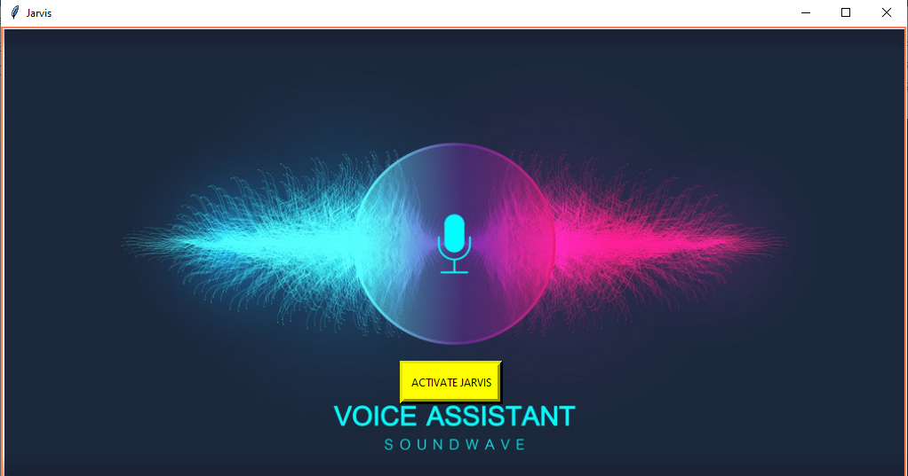
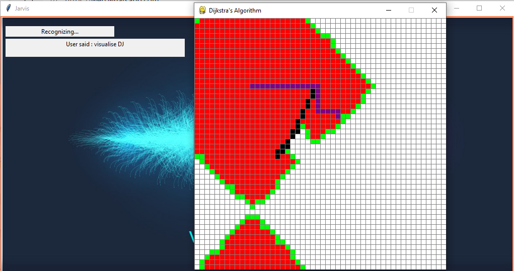
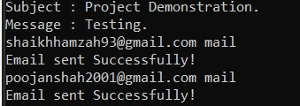

# Mini-Voice-Assistant
### Description about python packages used:
* We used **pygame** for visualizing the algorithms.
* Used **threading** module to use threads for running algorithms and sending of messages and email.
* imported **pyttsx** (text-to-speech) so that system can speak on the commands it interpreted.
* imported **speechRecognition** to make system understand our commands.
* imported **pywhatkit** to automate whatsapp and send email via voice commands.
*  imported **datetime** to get exact time for sending of WhatsApp messages.
* imported **Wikipedia** module to search stuff on Wikipedia. 
*  imported **os** for storing and retrieving data from files.
*  imported **re** for using Regex.

## Screenshots 

* Demonstrating Dijkstra on saying "Visulaize Dijkstra"

* Automated task of sending mail which uses multithreading to send emails immediately to more then 100 emails which must be saved in mail.txt file

